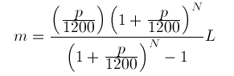

# Gormula - Formulae in Go / Golang

Playing with modeling math formula heavy computations upon streams of numbers,
using Go-routines and channels

So, in the code, the following formula borrowed from
[here](http://www.math.utah.edu/~pa/math/equations/equations.html)):



... with the following description:

> This is arguably the most important equation of the bunch. If you borrow an
> amount L dollars and pay it back over N months at an annual interest rate of
> p percent your monthly payment will be m dollars.

([source](http://www.math.utah.edu/~pa/math/equations/equations.html))

... is represented and used like this, in Go code:

```go
// --------------------------------------------------------------------------------
// Monthly Payment Formula
// --------------------------------------------------------------------------------
// Implementing the loan payments formula from here:
// http://www.math.utah.edu/~pa/math/equations/equations.html
// --------------------------------------------------------------------------------

// We try the formula over a sequence of values from 1000 to 10,000 USD
borrowedAmount := Seq(1000.0, 1000.0, 10000.0)

// Some initializations
rate := 2.0 // Percent
months := 24.0

// The formula
monthlyPaymentUSD := Mul(
    Div(
        Mul(
            Div(Val(rate), Val(1200.0)),
            Exp(
                Add(
                    Val(1.0),
                    Div(
                        Val(rate),
                        Val(1200.0))),
                Val(months))),
        Sub(
            Exp(
                Add(
                    Val(1.0),
                    Div(
                        Val(rate),
                        Val(1200.0))),
                Val(months)),
            Val(1.0))),
    borrowedAmount)

// Print out all the resulting monthly payments:
borrowedAmountForPrint := Seq(1000.0, 100.0, 10000.0)
for monthPay := range monthlyPaymentUSD {
    borrowed := <-borrowedAmountForPrint
    fmt.Printf("Monthly payment for 24 months, when borrowing %.2f USD: %.2f USD\n", borrowed, monthPay)
}
```

See the main.go file, for more details.
